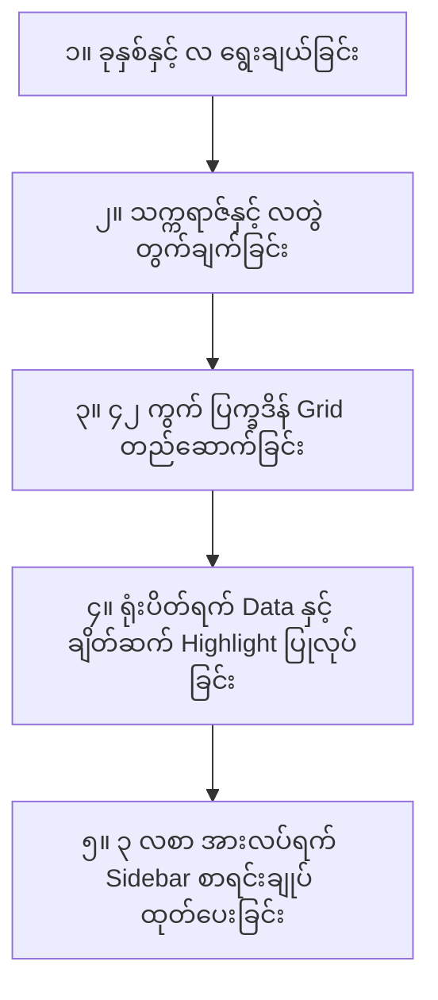
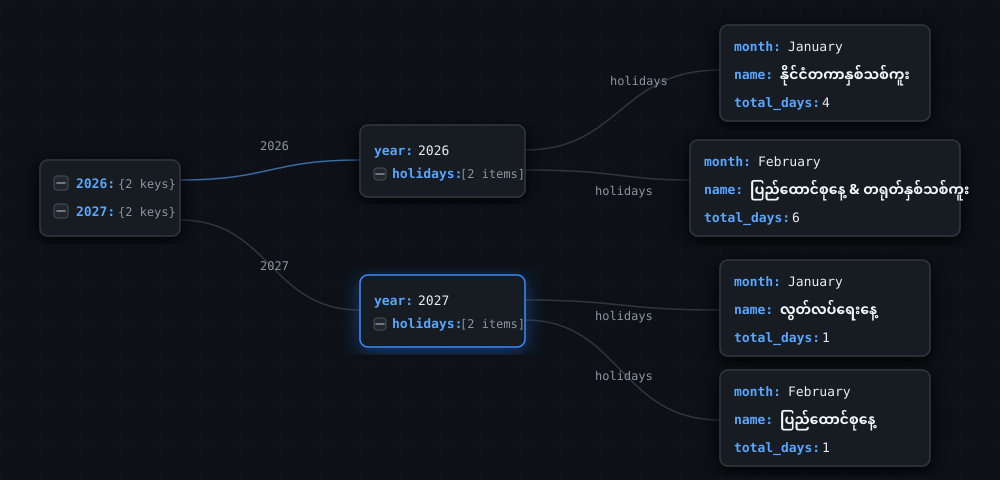

# Burma Calendar (မြန်မာပြက္ခဒိန်)


ပုံများနှင့် အချက်အလက်များကို **ပြည်ထောင်စုသမ္မတမြန်မာနိုင်ငံတော် အစိုးရပြန်တမ်း** နှင့် **မြန်မာ့ရိုးရာ ပြက္ခဒိန်စနစ်** ကို အခြေခံပြီး တိကျမှန်ကန်စွာ ကိုးကားရေးဆွဲထားပါသည်။

> **Summary (အကျဉ်းချုပ်)**
> 
> ခုနှစ်နှင့် လကို ရွေးချယ်မယ် ➔ သက်ဆိုင်ရာ မြန်မာသက္ကရာဇ်နှင့် မြန်မာလတွဲပြီး အလိုအလျောက် တွက်ချက်ပြသမယ် ➔ တနင်္ဂနွေမှ စနေအထိ ၄၂ ကွက် ပြက္ခဒိန် Grid ပေါ်တွင် မြန်မာ/အင်္ဂလိပ် ရက်စွဲများနှင့်အတူ အစိုးရရုံးပိတ်ရက်များကို အနီရောင်ဖြင့် Highlight အထူးပြုအရောင်ခြယ်ပေးမယ် ➔ ဘေးဘက် Sidebar တွင် လက်ရှိလအပါအဝင် နောက်လ ၃ လစာ ရုံးပိတ်ရက် စာရင်းချုပ်နှင့် စုစုပေါင်း ပိတ်ရက်အရေအတွက်ကို တစ်ပြိုင်နက်တည်း ကြည့်ရှုနိုင်မယ်။

---

## 📖 မြန်မာပြက္ခဒိန် အခြေခံဗဟုသုတ (Myanmar Calendar Knowledge for Beginners)

### ၁။ မြန်မာသက္ကရာဇ် (ကောဇာသက္ကရာဇ်) တွက်ချက်ပုံ (Myanmar Era Calculation)
မြန်မာသက္ကရာဇ် (ကောဇာသက္ကရာဇ်) သည် ခရစ်နှစ် (Gregorian Year) ထက် **၆၃၈ နှစ်** (သင်္ကြန်မတိုင်မီ **၆၃၉ နှစ်**) လျော့နည်းပါသည်။

* **သင်္ကြန်မတိုင်မီ ကာလများ (ဇန်နဝါရီ၊ ဖေဖော်ဝါရီ၊ မတ်):**
  $$\text{မြန်မာသက္ကရာဇ်} = \text{ခရစ်နှစ်} - ၆၃၉$$
  *(ဥပမာ - ၂၀၂၆ ခုနှစ် မတ်လ ➔ $2026 - 639 =$ **၁၃၈၇ ခု**)*
* **သင်္ကြန်ကာလ (ဧပြီလ - နှစ်ဟောင်းမှ နှစ်သစ်ကူးချိန်):**
  $$\text{မြန်မာသက္ကရာဇ်} = (\text{ခရစ်နှစ်} - ၆၃၉) \text{ / } (\text{ခရစ်နှစ်} - ၆၃၈)$$
  *(ဥပမာ - ၂၀၂၆ ခုနှစ် ဧပြီလ ➔ **၁၃၈၇ / ၁၃၈၈ ခု**)*
* **သင်္ကြန်ပြီးနောက် ကာလများ (မေ မှ ဒီဇင်ဘာ):**
  $$\text{မြန်မာသက္ကရာဇ်} = \text{ခရစ်နှစ်} - ၆၃၈$$
  *(ဥပမာ - ၂၀၂၆ ခုနှစ် မေလ ➔ $2026 - 638 =$ **၁၃၈၈ ခု**)*

---

### ၂။ မြန်မာလတွဲများ (Myanmar Month Pairs)
အင်္ဂလိပ်ပြက္ခဒိန်သည် နေဗဟိုပြု (Solar Calendar) စနစ်ဖြစ်ပြီး မြန်မာပြက္ခဒိန်သည် လဗဟိုပြု (Lunar Calendar) စနစ်ဖြစ်သောကြောင့် ရက်စွဲအစ/အဆုံး မတူညီပါ။ ထို့ကြောင့် **အင်္ဂလိပ် ၁ လအတွင်းတွင် မြန်မာလ ၂ လ အမြဲတွဲလျက် ပါဝင်နေပါသည်**။

| အင်္ဂလိပ်လ (English Month) | မြန်မာလတွဲ (Myanmar Month Pair) | အဓိပ္ပာယ် ရှင်းလင်းချက် |
| :--- | :--- | :--- |
| **01. January** | နတ်တော် / ပြာသို | နတ်တော်လကုန်ပြီး ပြာသိုလသို့ ကူးပြောင်းချိန် |
| **02. February** | ပြာသို / တပို့တွဲ | ပြာသိုလကုန်ပြီး တပို့တွဲလသို့ ကူးပြောင်းချိန် (ထမနဲပွဲတော်) |
| **03. March** | တပို့တွဲ / တပေါင်း | တပို့တွဲလကုန်ပြီး တပေါင်းလသို့ ကူးပြောင်းချိန် |
| **04. April** | တပေါင်း / တန်ခူး | မြန်မာ့နှစ်သစ်ကူး မဟာသင်္ကြန်ကာလ ကျရောက်ချိန် |
| **05. May** | တန်ခူး / ကဆုန် | တန်ခူးလကုန်ပြီး ကဆုန်လသို့ ကူးပြောင်းချိန် (ညောင်ရေသွန်းပွဲတော်) |
| **06. June** | ကဆုန် / နယုန် | ကဆုန်လကုန်ပြီး နယုန်လသို့ ကူးပြောင်းချိန် (စာပြန်ပွဲတော်) |
| **07. July** | နယုန် / ဝါဆို | နယုန်လကုန်ပြီး ဝါဆိုလသို့ ကူးပြောင်းချိန် (ဝါဆိုသင်္ကန်းကပ်လှူပွဲ) |
| **08. August** | ဝါဆို / ဝါခေါင် | ဝါတွင်းကာလ၊ ဝါခေါင်လ စာရေးတံမဲပွဲတော် |
| **09. September** | ဝါခေါင် / တော်သလင်း | တော်သလင်းလ လှေပြိုင်ပွဲတော်ကာလ |
| **10. October** | တော်သလင်း / သီတင်းကျွတ် | ဝါကျွတ်ကာလ သီတင်းကျွတ် မီးထွန်းပွဲတော် |
| **11. November** | သီတင်းကျွတ် / တန်ဆောင်မုန်း | တန်ဆောင်တိုင် မီးထွန်းပွဲတော်နှင့် ကထိန်ကာလ |
| **12. December** | တန်ဆောင်မုန်း / နတ်တော် | နတ်တော်လ စာဆိုတော်နေ့ကာလ |

---

### ၃။ မြန်မာဂဏန်းစနစ် (Myanmar Numerals)
ကွန်ပျူတာစနစ်မှ ထွက်လာသော အင်္ဂလိပ်ဂဏန်း `0` မှ `9` အား မြန်မာဂဏန်း `၀` မှ `၉` အဖြစ် Mapping ပြောင်းလဲသုံးစွဲထားပါသည်။

| အင်္ဂလိပ်ဂဏန်း | 0 | 1 | 2 | 3 | 4 | 5 | 6 | 7 | 8 | 9 |
| :--- | :---: | :---: | :---: | :---: | :---: | :---: | :---: | :---: | :---: | :---: |
| **မြန်မာဂဏန်း** | **၀** | **၁** | **၂** | **၃** | **၄** | **၅** | **၆** | **၇** | **၈** | **၉** |

---

### ၄။ ပြက္ခဒိန်ဇယားကွက် ဖတ်နည်း (How to Read the Calendar Grid)
ပြက္ခဒိန်ဇယားကွက်ပေါ်တွင် နေ့ရက်များကို အောက်ပါအတိုင်း အလွယ်တကူ ခွဲခြားကြည့်ရှုနိုင်ပါသည် -

* **တနင်္ဂနွေ မှ စနေ (SUN - SAT):** အပတ်စဉ် ၇ ရက် အစဉ်လိုက် ဖော်ပြထားပါသည်။
* **ရက်စွဲကွက်အတွင်း အချက်အလက်များ:**
  * **ထိပ်ပိုင်း:** မြန်မာဂဏန်းရက်စွဲ (ဥပမာ - `၁`၊ `၂`၊ `၃`)
  * **အလယ်:** အင်္ဂလိပ်ရက်စွဲ (ဥပမာ - `1`, `2`, `3`)
  * **အောက်ခြေ:** ရုံးပိတ်ရက်အမည် (ဥပမာ - `လွတ်လပ်ရေးနေ့`)
* **အရောင်အသွေး သတ်မှတ်ချက်များ (Legend):**
  * 🔴 **အစိုးရရုံးပိတ်ရက် (Holiday):** အနီရောင်ဖျော့ဖျော့ Background နှင့် ပိတ်ရက်အမည်ပါရှိခြင်း
  * 🟢 **ယနေ့ရက် (Today):** စိမ်းပြာရောင် Highlight နှင့် `ယနေ့` Marker တံဆိပ်ပါရှိခြင်း
  * 🔵 **စနေ / တနင်္ဂနွေ (Weekend):** သီးသန့်အရောင်ဖြင့် ခွဲခြားပြသထားခြင်း
  * ⚪ **လလွန်ရက်များ (Outside Days):** ပြီးခဲ့သည့်လနှင့် နောက်လများမှ ရက်များကို မီးခိုးရောင်မှိန်မှိန်ဖြင့် ပြသခြင်း

---

## 🌟 စနစ်အလုပ်လုပ်ပုံ အဆင့်ဆင့် (Procedure Steps)



### ၁။ ခုနှစ်နှင့် လ ရွေးချယ်ခြင်း (Month & Year Selection)
* အသုံးပြုသူသည် **၂၀၂၄ မှ ၂၀၂၇ အထိ** မိမိကြည့်လိုသော ခုနှစ်နှင့် လကို Dropdown မှ ရွေးချယ်နိုင်သလို **Next / Previous (< / >)** ခလုတ်များဖြင့်လည်း တစ်လချင်း အဆင်ပြေစွာ ရွှေ့ပြောင်းကြည့်ရှုနိုင်ပါသည်။
* လက်ရှိရောက်ရှိနေသော လနှင့် ရက်စွဲဆီ ချက်ချင်းပြန်သွားလိုပါက **"ဒီနေ့ (Today)"** ခလုတ်ကို နှိပ်လိုက်ရုံဖြင့် အချိန်မရွေး ပြန်ရောက်နိုင်ပါသည်။

### ၂။ ထိပ်စီးခေါင်းစဉ်နှင့် သက္ကရာဇ်တွက်ချက်မှု (Header & Era Display)
* ရွေးချယ်လိုက်သော ခုနှစ်နှင့် လအပေါ် မူတည်ပြီး `Header.tsx` က သက်ဆိုင်ရာ **မြန်မာသက္ကရာဇ် (ဥပမာ - သက္ကရာဇ်-၁၃၈၇ ခု၊)**၊ **မြန်မာလတွဲ (ဥပမာ - တပေါင်း / တန်ခူး)**၊ **အင်္ဂလိပ်လအမည် (ဥပမာ - March)** နှင့် **ခရစ်နှစ် (ဥပမာ - 2026)** တို့ကို အလိုအလျောက် တွက်ချက်တင်ပြပေးပါသည်။

### ၃။ ၄၂ ကွက် ပြက္ခဒိန်ဇယားကွက် ထုတ်လုပ်ခြင်း (42-Day Calendar Grid Generation)
* `CalendarGrid.tsx` သည် သက်ဆိုင်ရာလ၏ ပထမဆုံးရက် ကျရောက်သည့် နေ့ (Day of Week) ကို တွက်ချက်ပြီး တနင်္ဂနွေမှ စနေအထိ **၆ တန်း $\times$ ၇ ကော်လံ (စုစုပေါင်း ၄၂ ကွက်)** Grid အဖြစ် ဖန်တီးပေးပါသည်။
* လက်ရှိလအတွင်း မပါဝင်သော (ပြီးခဲ့သည့်လနှင့် လာမည့်လမှ) ရက်များကို မျက်စိမရှုပ်စေရန် `day-cell--outside` class ဖြင့် အရောင်မှိန်ပြသထားပါသည်။

### ၄။ အစိုးရရုံးပိတ်ရက်များ ချိတ်ဆက်ပြသခြင်း (Holiday Matching & Highlighting)
* `holidays.json` နှင့် `holidays-2027.json` Data များထဲမှ သက်ဆိုင်ရာ လနှင့် ရက်စွဲများကို Filter ပြုလုပ်ကာ တိုက်ဆိုင်စစ်ဆေးပါသည်။
* ရုံးပိတ်ရက်ဖြစ်ပါက Calendar Grid ကွက်ပေါ်တွင် အနီရောင် Badge နှင့်အတူ ပိတ်ရက်အမည် (ဥပမာ - `မဟာသင်္ကြန် ရုံးပိတ်ရက်များ`၊ `အမျိုးသားနေ့`) ကို တိုက်ရိုက်ဖော်ပြပေးပါသည်။

### ၅။ ၃ လတာ အားလပ်ရက် စာရင်းချုပ် Sidebar (3-Month Holiday Summary)
* `HolidayList.tsx` သည် လက်ရှိရွေးချယ်ထားသော လအပါအဝင် ရှေ့သို့ ၂ လ (စုစုပေါင်း ၃ လတာ) ကာလအတွင်း ကျရောက်မည့် ရုံးပိတ်ရက်များ အားလုံးကို စုစည်းပြသပေးပါသည်။
* ၃ လအတွင်း ကျရောက်မည့် စုစုပေါင်း ပိတ်ရက်အရေအတွက် (**ဥပမာ - ၁၂ ရက်**) ကို ခေါင်းစဉ်တွင် ကိန်းဂဏန်းဖြင့် ဖော်ပြပေးပြီး၊ လအလိုက် ပိတ်ရက်အမည်များနှင့် ရက်စွဲများကို အစီအစဉ်တကျ စာရင်းပြုစုပေးထားပါသည်။

---

## 📊 Holiday Data Mind Map & Data Structure



### 📌 JSON Data Structure ရှင်းလင်းချက်
ရုံးပိတ်ရက် အချက်အလက်များကို `src/data/holidays.json` တွင် အောက်ပါ Data Structure အတိုင်း သိမ်းဆည်းထားပါသည် -

```json
{
  "years": {
    "2026": {
      "year": 2026,
      "holidays": [
        {
          "month": "January",
          "name": "လွတ်လပ်ရေးနေ့",
          "dates": ["4"],
          "total_days": 1
        },
        {
          "month": "April",
          "name": "မဟာသင်္ကြန် ရုံးပိတ်ရက်များ",
          "dates": ["13", "14", "15", "16", "17"],
          "total_days": 5
        }
      ]
    }
  }
}
```

* **`years` (Root Object):** ရရှိနိုင်သော ခုနှစ်အားလုံး၏ စုစည်းမှု။
* **`year` (Number):** သက်ဆိုင်ရာ ခုနှစ် (ဥပမာ - `2024`, `2025`, `2026`, `2027`)။
* **`holidays` (Array):** အဆိုပါနှစ်အတွင်း ကျရောက်သော ရုံးပိတ်ရက်စာရင်းများ။
  * **`month` (String):** ပိတ်ရက်ကျရောက်သည့် အင်္ဂလိပ်လအမည် (ဥပမာ - `January`, `April`)။
  * **`name` (String):** မြန်မာဘာသာဖြင့် ရုံးပိတ်ရက်အမည် (ဥပမာ - `လွတ်လပ်ရေးနေ့`)။
  * **`dates` (Array of Strings):** ပိတ်ရက်ကျရောက်သည့် ရက်စွဲများ (ဥပမာ - `["13", "14", "15", "16", "17"]`)။
  * **`total_days` (Number):** စုစုပေါင်း ပိတ်ရက်အရေအတွက် (ဥပမာ - `5`)။
  * **`type` (Optional String):** ပိတ်ရက်အမျိုးအစား (ဥပမာ - `Bridge Holiday`, `Public Holiday`)။

---

⭐ ဤပရောဂျက်သည် မြန်မာ့ပြက္ခဒိန် အချက်အလက်များနှင့် နည်းပညာကို လေ့လာလိုသူ မည်သူမဆို အသုံးပြု၊ လေ့လာ၊ မျှဝေနိုင်ရန် ဖန်တီးထားခြင်း ဖြစ်ပါသည်။
