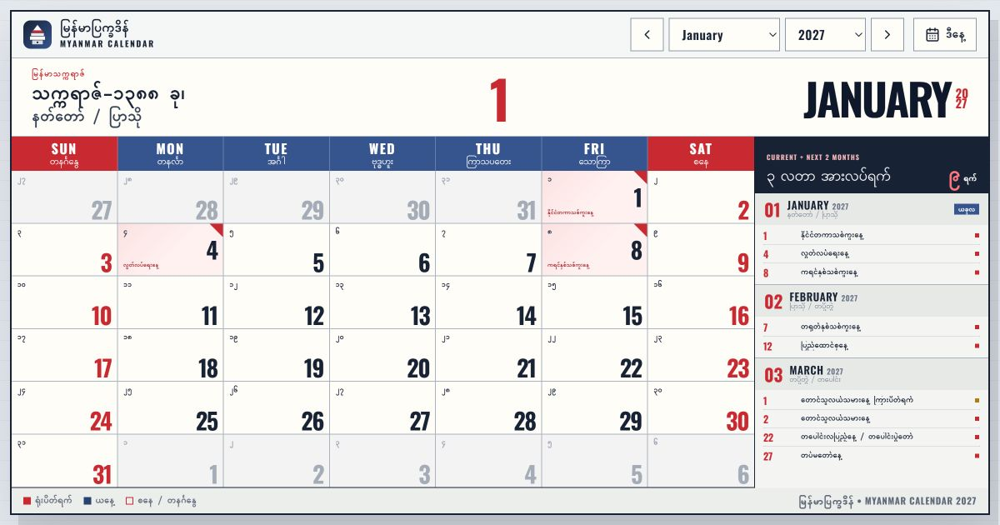

# Burma Calendar (မြန်မာပြက္ခဒိန်)



ပုံများနှင့် အချက်အလက်များအား **ပြည်ထောင်စုသမ္မတမြန်မာနိုင်ငံတော် အစိုးရပြန်တမ်း** နှင့် **မြန်မာ့ပြက္ခဒိန် အစဉ်အလာများ** မှ ကူးယူကိုးကားဖော်ပြထားပါသည်။  
ဒီဇိုင်းနှင့် Icon များအတွက် [Lucide Icons](https://lucide.dev/) နှင့် [Tailwind CSS](https://tailwindcss.com/) တို့ကို အသုံးပြုထားပါသည်။

> **Summary**  
> ခုနှစ်နှင့် လ ရွေးချယ်မယ် -> ရလာတဲ့ ရက်စွဲကို မြန်မာသက္ကရာဇ်နှင့် မြန်မာလတွဲ တွက်ချက်မှု Logic ဖြင့် စစ်ဆေးမယ် -> ရုံးပိတ်ရက် Data များနှင့် ချိတ်ဆက်ပြီး Calendar Grid ပေါ်တွင် Highlight ပြသမယ် -> ၃ လတာ အားလပ်ရက်စာရင်းကို Sidebar တွင် စုစည်းပြသမယ် -> မြန်မာ့ရာသီ ၃ မျိုး (ဆောင်း၊ နွေ၊ မိုး) အလိုက် Seasonal Theming စနစ်ဖြင့် အလိုအလျောက် ပြောင်းလဲပေးမယ်။

---

### 🌟 အဓိကလုပ်ဆောင်ချက်များ (Procedure Steps)

1. **ခုနှစ်နှင့် လ ရွေးချယ်နိုင်ခြင်း (Month & Year Selection)**  
   - ၂၀၂၄ မှ ၂၀၂၇ အထိ စိတ်ကြိုက်ပြောင်းလဲနိုင်ပြီး Dropdown သို့မဟုတ် Next / Previous ခလုတ်များဖြင့် လွယ်ကူစွာ ရွေးချယ်နိုင်ပါသည်။  
   - **"ဒီနေ့ (Today)"** ခလုတ်ကို နှိပ်လိုက်ရုံဖြင့် လက်ရှိရောက်ရှိနေသော လနှင့် ရက်စွဲသို့ ချက်ချင်း ပြန်လည်ရောက်ရှိစေပါသည်။

2. **ပြက္ခဒိန်ဇယားကွက် ဖော်ပြခြင်း (Calendar Grid View)**  
   - တနင်္ဂနွေမှ စနေနေ့အထိ ၇ ရက် Grid ပေါ်တွင် အင်္ဂလိပ်ရက်စွဲ (Gregorian Date) နှင့် မြန်မာဂဏန်းရက်စွဲ (၁၊ ၂၊ ၃ ...) များကို တွဲဖက်ဖော်ပြပေးပါသည်။  
   - စနေ၊ တနင်္ဂနွေ (Weekend) ရက်များ၊ ယနေ့ရက် (Today) နှင့် အစိုးရရုံးပိတ်ရက် (Public Holidays) များကို အရောင်ခွဲခြားကာ Badge လေးများဖြင့် ထင်ရှားစွာ ပြသပေးပါသည်။

3. **မြန်မာသက္ကရာဇ်နှင့် လတွဲများ တွက်ချက်ပြသခြင်း (Myanmar Era & Month Pairs)**  
   - Header တွင် ရွေးချယ်ထားသော လအလိုက် သက်ဆိုင်သည့် **မြန်မာသက္ကရာဇ် (ဥပမာ - ၁၃၈၆ ခု)** နှင့် **မြန်မာလတွဲ (ဥပမာ - တပေါင်း / တန်ခူး)** ကို အလိုအလျောက် တွက်ချက်ဖော်ပြပါသည်။  
   - သင်္ကြန်ကာလ (ဧပြီလ) တွင် နှစ်ဟောင်း/နှစ်သစ် သက္ကရာဇ် ၂ ခု ကူးပြောင်းချိန်ကို စနစ်တကျ ခွဲခြားတွက်ချက်ပေးထားပါသည်။

4. **၃ လတာ အားလပ်ရက်စာရင်း (3-Month Holiday Overview Sidebar)**  
   - လက်ရှိလ အပါအဝင် နောက်လာမည့် ၂ လ (စုစုပေါင်း ၃ လတာ) အတွက် အစိုးရရုံးပိတ်ရက် စုစုပေါင်း အရေအတွက်နှင့် အားလပ်ရက် အမည်များကို Sidebar တွင် ရှင်းလင်းစွာ စာရင်းပြုစု ပြသပေးပါသည်။

5. **မြန်မာ့ရာသီ ၃ မျိုးအလိုက် Adaptive UI Theme စနစ် (Seasonal Theming Engine)**  
   - မြန်မာနိုင်ငံ၏ ရာသီဥတု ၃ မျိုးပေါ် မူတည်၍ UI Theme သည် အလိုအလျောက် ပြောင်းလဲပေးပါသည်:  
     - ❄️ **ဆောင်းရာသီ (Cool Season - နိုဝင်ဘာ မှ ဖေဖော်ဝါရီ)** : အေးမြကြည်လင်သော Blue Frost Palette  
     - ☀️ **နွေရာသီ (Hot Season - မတ် မှ မေ)** : နွေးထွေးတောက်ပသော Sunlight Amber Palette  
     - 🌧️ **မိုးရာသီ (Rainy Season - ဇွန် မှ အောက်တိုဘာ)** : စိမ်းလန်းစိုပြေသော Emerald Green Palette  
   - Dark Mode နှင့် Light Mode နှစ်မျိုးစလုံးတွင် လှပစွာ အသုံးပြုနိုင်ပါသည်။

6. **PWA (Progressive Web App) & Offline အသုံးပြုနိုင်ခြင်း**  
   - ဖုန်းနှင့် Desktop များတွင် Native App တစ်ခုကဲ့သို့ Install ပြုလုပ်နိုင်ပြီး အင်တာနက်လိုင်းမရှိချိန် (Offline) တွင်လည်း ပြက္ခဒိန်ကို အဆင်ပြေစွာ ဖွင့်ကြည့်နိုင်ပါသည်။

---

### 📊 ဒေတာဖွဲ့စည်းပုံ မင်းဒ်မက် (Holiday Data Mind Map)


> **Mind Map ဒေတာဖွဲ့စည်းပုံ ရှင်းလင်းချက်:**  
> - **Year Root (ခုနှစ်အဆင့်):** `2026`, `2027` စသည့် ခုနှစ်တစ်ခုချင်းစီကို Root Key အဖြစ် ခွဲခြားသတ်မှတ်ထားပါသည်။  
> - **Holidays Collection (ပိတ်ရက်များ အစုအဝေး):** သက်ဆိုင်ရာ ခုနှစ်အောက်တွင် အားလပ်ရက် အချက်အလက်များကို Array ပုံစံဖြင့် စုစည်းသိမ်းဆည်းထားပါသည်။  
> - **Month & Details Node (လနှင့် အသေးစိတ် အချက်အလက်များ):**  
>   - `month`: ပိတ်ရက်ကျရောက်သော လအမည် (ဥပမာ - `January`, `February`)  
>   - `name`: ရုံးပိတ်ရက် အမည် (ဥပမာ - `နိုင်ငံတကာနှစ်သစ်ကူး`၊ `ပြည်ထောင်စုနေ့ & တရုတ်နှစ်သစ်ကူး`၊ `လွတ်လပ်ရေးနေ့`)  
>   - `total_days`: အဆိုပါ အားလပ်ရက်အတွက် စုစုပေါင်း ခံစားခွင့်ရရှိမည့် ပိတ်ရက်အရေအတွက် (ဥပမာ - `4 days`, `6 days`, `1 day`)

---

### 👥 Participants
1. [Sann Lynn Htun](https://github.com/sannlynnhtun-coding)
2. [Yoke Sann](https://github.com/yokesann)

---

### 🤝 Contributors

<table>
 <thead>
  <tr>
   <th colspan="2">Contributors</th>
  </tr>
 </thead>
 <tbody>
  <tr>
   <td align="center">
     <a href="https://github.com/sannlynnhtun-coding">
       <br />
       <sub><b>sannlynnhtun-coding</b></sub>
     </a>
   </td>
   <td align="center">
     <a href="https://github.com/yokesann">
       <br />
       <sub><b>yokesann</b></sub>
     </a>
   </td>
  </tr>
 </tbody>
</table>

---

### 💡 Changes & Credit Owner

- **၂၀၂၇ ခုနှစ် အစိုးရရုံးပိတ်ရက် ဒေတာများ ဖြည့်စွက်ခြင်း**  
  [holidays-2027.json](file:///d:/testing/src/data/holidays-2027.json) တွင် ၂၀၂၇ ခုနှစ်အတွက် Bridge Holidays နှင့် Public Holidays ဒေတာများကို ကူညီဖြည့်စွက်ပေးထားပါသည်။
- **မြန်မာသက္ကရာဇ်နှင့် ရာသီအလိုက် Theme ပြောင်းလဲခြင်း Logic**  
  သင်္ကြန်အကူးအပြောင်း သက္ကရာဇ် တွက်ချက်မှုနှင့် မြန်မာ့ရာသီ ၃ မျိုး (ဆောင်း၊ နွေ၊ မိုး) အရောင်အသွေး စနစ်များအား သဘာဝကျကျ ရေးသားဖြည့်စွက်ပေးထားပါသည်။

---

### 💻 Reference Code & Usage Examples

စမ်းသပ်ကြည့်ရှုနိုင်ရန်နှင့် အခြားသော Project များတွင် အလွယ်တကူ ကူးယူအသုံးပြုနိုင်ရန် အဓိက Logic များကို အောက်တွင် ဖော်ပြပေးထားပါသည်။

#### ၁။ အင်္ဂလိပ်ဂဏန်းမှ မြန်မာဂဏန်းသို့ ပြောင်းလဲခြင်း (Myanmar Numerals Converter)

အင်္ဂလိပ်ဂဏန်း (0 မှ 9) များကို သက်ဆိုင်ရာ မြန်မာဂဏန်း (၀ မှ ၉) အဖြစ် တိုက်ရိုက် အစားထိုးပြောင်းလဲပေးသည့် Logic ဖြစ်ပါသည်။ ခုနှစ် (ဥပမာ - 2026 ကို "၂၀၂၆") သို့မဟုတ် ရက်စွဲ (ဥပမာ - 12 ကို "၁၂") စသည်ဖြင့် ပြောင်းလဲရာတွင် အသုံးပြုပါသည်။

```typescript
const MYANMAR_DIGITS: Record<string, string> = {
  '0': '၀', '1': '၁', '2': '၂', '3': '၃', '4': '၄',
  '5': '၅', '6': '၆', '7': '၇', '8': '၈', '9': '၉',
};

export function toMyanmarNumerals(value: number | string): string {
  return String(value)
    .split('')
    .map((digit) => MYANMAR_DIGITS[digit] ?? digit)
    .join('');
}
```

စမ်းသပ်ခေါ်ယူမှုနှင့် ရလဒ်များ:
- `toMyanmarNumerals(2026)` ကို ခေါ်ယူပါက `၂၀၂၆` ဟု ထွက်ရှိပါမည်။
- `toMyanmarNumerals(12)` ကို ခေါ်ယူပါက `၁၂` ဟု ထွက်ရှိပါမည်။

---

#### ၂။ မြန်မာသက္ကရာဇ် တွက်ချက်ခြင်း (Myanmar Era Calculation)

မြန်မာသက္ကရာဇ်သည် သင်္ကြန်ကျရောက်သည့် ဧပြီလတွင် နှစ်သစ်သို့ ကူးပြောင်းသောကြောင့် ဇန်နဝါရီမှ မတ်လအတွင်းတွင် (ခုနှစ် - ၆၃၉) ဖြင့် တွက်ထုတ်ပြီး၊ မေလမှ ဒီဇင်ဘာလအတွင်းတွင် (ခုနှစ် - ၆၃၈) ဖြင့် တွက်ထုတ်ပါသည်။ သင်္ကြန်ကာလ ဧပြီလတွင်မူ သက္ကရာဇ်နှစ်ခု ကူးပြောင်းချိန်အဖြစ် (ဥပမာ - "၁၃၈၇ / ၁၃၈၈") ပုံစံဖြင့် တွဲဖက်ဖော်ပြပေးပါသည်။

```typescript
export function getMyanmarEraLabel(date: Date): string {
  const year = date.getFullYear();
  const month = date.getMonth();

  if (month === 3) {
    return `${toMyanmarNumerals(year - 639)} / ${toMyanmarNumerals(year - 638)}`;
  }

  return toMyanmarNumerals(year - (month < 3 ? 639 : 638));
}
```

စမ်းသပ်ခေါ်ယူမှုနှင့် ရလဒ်များ:
- ဇန်နဝါရီလ ၁ ရက် ၂၀၂၆ အတွက် `getMyanmarEraLabel(new Date(2026, 0, 1))` ဟု ခေါ်ယူပါက `၁၃၈၇` ဟု ထွက်ရှိပါမည်။
- ဧပြီလ ၁၅ ရက် ၂၀၂၆ အတွက် `getMyanmarEraLabel(new Date(2026, 3, 15))` ဟု ခေါ်ယူပါက `၁၃၈၇ / ၁၃၈၈` ဟု ထွက်ရှိပါမည်။

---

#### ၃။ မြန်မာ့ရာသီ ၃ မျိုး ခွဲခြားတွက်ချက်ခြင်း (Myanmar Season Logic)

မြန်မာနိုင်ငံ၏ ရာသီဥတု ၃ မျိုးအလိုက် လများကို အောက်ပါအတိုင်း ခွဲခြားသတ်မှတ်ထားပါသည်:
- ဆောင်းရာသီ (Cool): နိုဝင်ဘာ၊ ဒီဇင်ဘာ၊ ဇန်နဝါရီ၊ ဖေဖော်ဝါရီ
- နွေရာသီ (Hot): မတ်၊ ဧပြီ၊ မေ
- မိုးရာသီ (Rainy): ဇွန်၊ ဇူလိုင်၊ သြဂုတ်၊ စက်တင်ဘာ၊ အောက်တိုဘာ

```typescript
export enum MyanmarSeason {
  COOL = 'cool',
  HOT = 'hot',
  RAINY = 'rainy',
}

export function getMyanmarSeason(month: number): MyanmarSeason {
  if (month === 10 || month === 11 || month === 0 || month === 1) {
    return MyanmarSeason.COOL;
  }
  if (month === 2 || month === 3 || month === 4) {
    return MyanmarSeason.HOT;
  }
  return MyanmarSeason.RAINY;
}
```

စမ်းသပ်ခေါ်ယူမှုနှင့် ရလဒ်များ:
- `getMyanmarSeason(0)` (ဇန်နဝါရီလ) အတွက် `cool` (ဆောင်းရာသီ) ဟု ရရှိပါမည်။
- `getMyanmarSeason(3)` (ဧပြီလ) အတွက် `hot` (နွေရာသီ) ဟု ရရှိပါမည်။
- `getMyanmarSeason(6)` (ဇူလိုင်လ) အတွက် `rainy` (မိုးရာသီ) ဟု ရရှိပါမည်။

---

### 🛠️ Built With (အသုံးပြုထားသော နည်းပညာများ)

- **[React 18](https://react.dev/)** - Component-based UI Library
- **[TypeScript](https://www.typescriptlang.org/)** - Static Type Checking
- **[Vite](https://vitejs.dev/)** - Fast Frontend Build Tool
- **[Tailwind CSS](https://tailwindcss.com/)** - Utility-First CSS Framework
- **[shadcn/ui](https://ui.shadcn.com/)** - Accessible UI Components
- **[Framer Motion](https://www.framer.com/motion/)** - Smooth UI Animations
- **[Lucide Icons](https://lucide.dev/)** - Modern Clean Icons
- **[Vite PWA](https://vite-pwa-org.netlify.app/)** - Offline Support & Installable PWA

---

### 🚀 Getting Started (စတင်အသုံးပြုနည်း)

#### လိုအပ်ချက်များ (Prerequisites)
- [Node.js](https://nodejs.org/) (Version 18 သို့မဟုတ် အထက်)
- `npm` / `pnpm` / `yarn`

#### Installation Steps

၁။ Repository အား Clone ပြုလုပ်ပါ:
```bash
git clone https://github.com/chit-hmue-than-thar/testing.git
cd testing
```

၂။ လိုအပ်သော Packages များကို Install ပြုလုပ်ပါ:
```bash
npm install
```

၃။ Development Server ကို စတင် Run ပါ:
```bash
npm run dev
```

၄။ Production Build ပြုလုပ်ရန်:
```bash
npm run build
```

---

### 📄 License

This project is licensed under the [MIT License](LICENSE).

---

<div align="center">
  <sub>Blending Myanmar tradition with modern technology • မြန်မာ့ရိုးရာယဉ်ကျေးမှုနှင့် ခေတ်မီနည်းပညာ ပေါင်းစပ်မှု 🇲🇲</sub>
</div>
